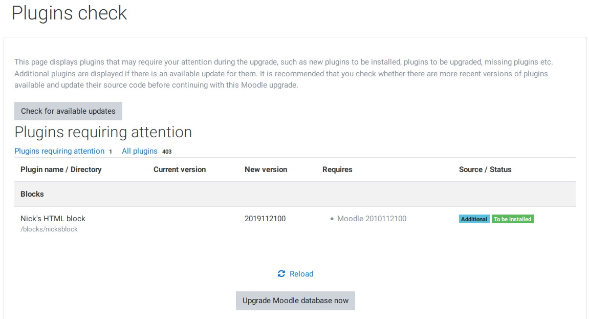
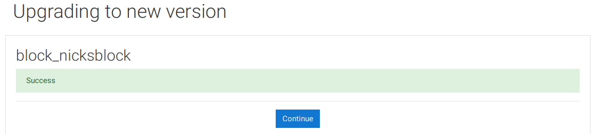
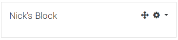

# **Moodle Block Tutorial**

    blocks/nicksblock
        |
        |-- block_nicksblock.php
        |
        |-- /db
        |    |
        |    |-- access.php
        |
        |-- /lang/en
        |    |
        |    |-- block_nicksblock.php
        |
        |-- version.php

## block_nicksblock.php

    <?php
    class block_nicksblock extends block_base {
        public function init() {
            $this->title = get_string('nicksblock', 'block_nicksblock');
        }
    }

## /db/access.php

    <?php
        $capabilities = array(

        'block/nicksblock:myaddinstance' => array(
            'captype' => 'write',
            'contextlevel' => CONTEXT_SYSTEM,
            'archetypes' => array(
                'user' => CAP_ALLOW
            ),

            'clonepermissionsfrom' => 'moodle/my:manageblocks'
        ),

        'block/nicksblock:addinstance' => array(
            'riskbitmask' => RISK_SPAM | RISK_XSS,

            'captype' => 'write',
            'contextlevel' => CONTEXT_BLOCK,
            'archetypes' => array(
                'editingteacher' => CAP_ALLOW,
                'manager' => CAP_ALLOW
            ),

            'clonepermissionsfrom' => 'moodle/site:manageblocks'
        ),
    );

## /lang/en/block_nicksblock.php

    <?php

    $string['pluginname'] = 'Nick\'s HTML block';
    $string['nicksblock'] = 'Nick\'s Block';
    $string['nicksblock:addinstance'] = 'Add a new Nick HTML block';
    $string['nicksblock:myaddinstance'] = 'Add a new Nick HTML block to the My Moodle page';

## version.php

    <?php

    $plugin->component = 'block_nicksblock';  // Recommended since 2.0.2 (MDL-26035). Required since 3.0 (MDL-48494)
    $plugin->version = 2019112100;  // YYYYMMDDHH (year, month, day, 24-hr time)
    $plugin->requires = 2010112500; // YYYYMMDDHH (This is the release version for Moodle 2.0)

## Plugin check

When you reload your Moodle site, it'll redirect to the plugin check page.

Update the database, your plugin should now be added to your Moodle site.

## Add your block

You can now add your block by turning blocks editing on (click the gear icon or the button)
Then click 'Add a block', and select Nick's HTML block.

The block should now appear on the page.

