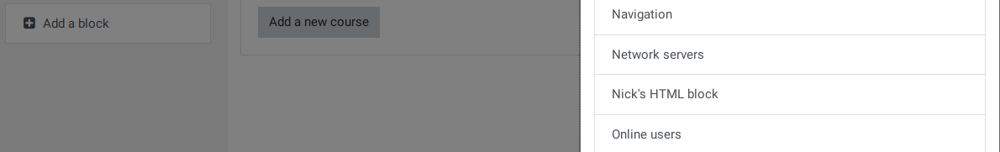

# **Moodle Block Tutorial**

    blocks/nicksblock
        |
        |-- block_nicksblock.php
        |
        |-- /db
        |    |
        |    |-- access.php
        |
        |-- /lang/en
        |    |
        |    |-- block_nicksblock.php
        |
        |-- version.php

## block_nicksblock.php

    <?php
    class block_nicksblock extends block_base {
        public function init() {
            $this->title = get_string('nicksblock', 'block_nicksblock');
        }
    }

## /db/access.php

    <?php
        $capabilities = array(

        'block/nicksblock:myaddinstance' => array(
            'captype' => 'write',
            'contextlevel' => CONTEXT_SYSTEM,
            'archetypes' => array(
                'user' => CAP_ALLOW
            ),

            'clonepermissionsfrom' => 'moodle/my:manageblocks'
        ),

        'block/nicksblock:addinstance' => array(
            'riskbitmask' => RISK_SPAM | RISK_XSS,

            'captype' => 'write',
            'contextlevel' => CONTEXT_BLOCK,
            'archetypes' => array(
                'editingteacher' => CAP_ALLOW,
                'manager' => CAP_ALLOW
            ),

            'clonepermissionsfrom' => 'moodle/site:manageblocks'
        ),
    );

## /lang/en/block_nicksblock.php

    <?php

    $string['pluginname'] = 'Nick\'s HTML block';
    $string['nicksblock'] = 'Nick\'s Block';
    $string['nicksblock:addinstance'] = 'Add a new Nick HTML block';
    $string['nicksblock:myaddinstance'] = 'Add a new Nick HTML block to the My Moodle page';

## version.php

    <?php

    $plugin->component = 'block_nicksblock';  // Recommended since 2.0.2 (MDL-26035). Required since 3.0 (MDL-48494)
    $plugin->version = 2019112100;  // YYYYMMDDHH (year, month, day, 24-hr time)
    $plugin->requires = 2010112500; // YYYYMMDDHH (This is the release version for Moodle 2.0)

## Plugin check

When you reload your Moodle site, it'll redirect to the plugin check page.

Update the database, your plugin should now be added to your Moodle site.

## Add your block

You can now add your block by turning blocks editing on (click the gear icon or the button)
Then click 'Add a block', and select Nick's HTML block.

The block should now appear on the page.

## Block content

    <?php

    class block_nicksblock extends block_base {
        public function init() {
            $this->title = get_string('nicksblock', 'block_nicksblock');
        }

        public function get_content() {
            if ($this->content !== null) {
                return $this->content;
            }

            $this->content         =  new stdClass;
            $this->content->text   = 'The content of Nick\'s block.';
            $this->content->footer = 'Footer here...';

            return $this->content;
        }
    }

## Instance configuration

Create a new file: edit_form.php

    <?php

    class block_nicksblock_edit_form extends block_edit_form {

        protected function specific_definition($mform) {

            // Section header title according to language file.
            $mform->addElement('header', 'config_header', get_string('blocksettings', 'block'));

            // A sample string variable with a default value.
            $mform->addElement('text', 'config_text', get_string('blockstring', 'block_nicksblock'));
            $mform->setDefault('config_text', 'default value');
            $mform->setType('config_text', PARAM_RAW);

        }
    }

Add this line to the language file:

    $string['blockstring'] = 'Sample string variable';

You may need to clear your site's cache for this to show up.
(Site Administration -> Development -> Purge all caches)

## Customize the title of the block

Add this to edit_form.php

    $mform->addElement('text', 'config_title', get_string('blocktitle', 'block_nicksblock'));
            $mform->setDefault('config_title', 'default value');
            $mform->setType('config_title', PARAM_TEXT);

Add this block_nicksblock.php

    public function specialization() {
            if (isset($this->config)) {
                if (empty($this->config->title)) {
                    $this->title = get_string('defaulttitle', 'block_nicksblock');
                } else {
                    $this->title = $this->config->title;
                }

                if (empty($this->config->text)) {
                    $this->config->text = get_string('defaulttext', 'block_nicksblock');
                }
            }
        }

## Multiple instances of the same block

Add this to block_nicksblock.php

    public function instance_allow_multiple() {
            return true; 
        }
