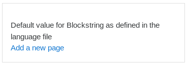
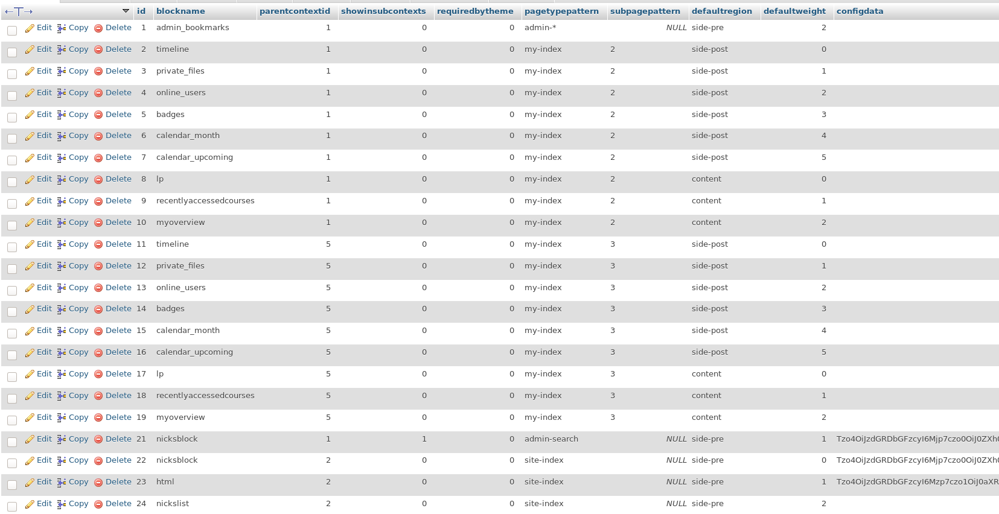
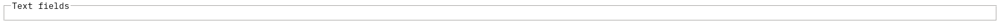
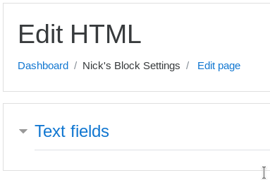
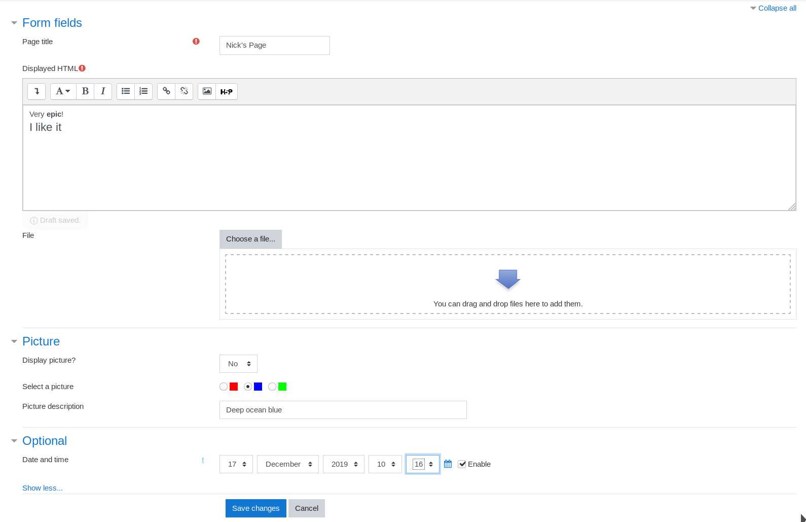
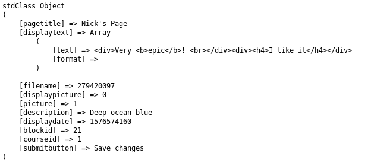

# **Moodle Advanced Block Tutorial**

## Recap

Currently we have the following files:

    blocks/nicksblock
            |
            |-- db/
            |    |
            |    |-- access.php
            |
            |-- lang/en
            |    |
            |    |-- block_nicksblock.php
            |
            |-- block_nicksblock.php
            |
            |-- edit_form.php
            |
            |-- settings.php
            |
            |-- version.php
            
The file contents are as follows:

### db/access.php

    <?php
    
    $capabilities = array(
    
            'block/nicksblock:myaddinstance' => array(
                    'captype' => 'write',
                    'contextlevel' => CONTEXT_SYSTEM,
                    'archetypes' => array(
                            'user' => CAP_ALLOW
                    ),
    
                    'clonepermissionsfrom' => 'moodle/my:manageblocks'
            ),
    
            'block/nicksblock:addinstance' => array(
                    'riskbitmask' => RISK_SPAM | RISK_XSS,
    
                    'captype' => 'write',
                    'contextlevel' => CONTEXT_BLOCK,
                    'archetypes' => array(
                            'editingteacher' => CAP_ALLOW,
                            'manager' => CAP_ALLOW
                    ),
    
                    'clonepermissionsfrom' => 'moodle/site:manageblocks'
            ),
    );
    
### lang/en/block_nicksblock.php

    <?php
    
    $string['pluginname'] = 'Nick\'s Basic block';
    $string['nicksblock'] = 'Nick\'s Block Settings'; // Default title for block
    $string['nicksblock:addinstance'] = 'Add a new HTML block';
    $string['nicksblock:myaddinstance'] = 'Add a new HTML block to the My Moodle page';
    $string['blockstring'] = 'Default value for Blockstring as defined in the language file';
    $string['blocktitle'] = 'Default title for this block';
    $string['headerconfig'] = 'Nick\'s Block Configuration';
    $string['descconfig'] = 'HTML settings';
    $string['labelallowhtml'] = 'Allow HTML?';
    $string['descallowhtml'] = 'Checking this option will strip HTML tags';
    
 ### block_nicksblock.php
 
     <?php
     
     class block_nicksblock extends block_base {
         public function init() {
             $this->title = get_string('nicksblock', 'block_nicksblock');
         }
     
         public function get_content() {
             if ($this->content !== null) {
                 return $this->content;
             }
     
             $this->content = new stdClass;
             $this->content->text = get_string('blockstring', 'block_nicksblock');
             $this->content->footer = 'Block footer';
     
             return $this->content;
         }
     
         public function specialization() {
             if (isset($this->config)) {
                 if (empty($this->config->title)) {
                     $this->title = get_string('defaulttitle', 'block_nicksblock');
                 } else {
                     $this->title = $this->config->title;
                 }
     
                 if (empty($this->config->text)) {
                     $this->config->text = get_string('defaulttext', 'block_nicksblock');
                 }
             }
         }
     
         public function instance_allow_multiple() {
             return true;
         }
     
         // This function is required to enable global configuration
         public function has_config() {
             return true;
         }
     
         public function instance_config_save($data, $nolongerused = false) {
             if(get_config('nicksblock', 'Allow_HTML') == '0') {
                 $data->text = strip_tags($data->text);
             }
     
             return parent::instance_config_save($data, $nolongerused);
         }
     
         public function hide_header() {
             return true;
         }
     
         public function html_attributes() {
             $attributes = parent::html_attributes(); // Get default values
             $attributes['class'] .= ' block_' . $this->name(); // Append our class to class attribute
             return $attributes;
         }
     
         public function applicable_formats() {
             return array('site-index' => true);
         }
     }
     
### edit_form.php

    <?php
    
    class block_nicksblock_edit_form extends block_edit_form {
    
        protected function specific_definition($mform) {
            // Section header title according to language file.
            $mform->addElement('header', 'config_header', get_string('blocksettings', 'block'));
    
            // A sample string variable with a default value.
            $mform->addElement('text', 'config_text', get_string('blockstring', 'block_nicksblock'));
            $mform->setDefault('config_text', 'default value');
    
            $mform->setType('config_text', PARAM_RAW);
    
            $mform->addElement('text', 'config_title', get_string('blocktitle', 'block_nicksblock'));
            $mform->setDefault('config_title', 'default value');
            $mform->setType('config_title', PARAM_TEXT);
        }
    }
    
### settings.php

    <?php
    
    $settings->add(new admin_setting_heading(
            'headerconfig',
            get_string('headerconfig', 'block_nicksblock'),
            get_string('descconfig', 'block_nicksblock')
    ));
    
    $settings->add(new admin_setting_configcheckbox(
            'nicksblock/Allow_HTML',
            get_string('labelallowhtml', 'block_nicksblock'),
            get_string('descallowhtml', 'block_nicksblock'),
            '0'
    ));

### version.php 

    <?php
    
    $plugin->component = 'block_nicksblock';
    $plugin->version = 2019112000;
    $plugin->requires = 2019111800;
    
## Adding forms

Create the file **nicksblock_form.php**

    <?php
    
    require_once("{$CFG->libdir}/formslib.php");
    
    class nicksblock_form extends moodleform {
    
        function definition() {
            // Quick form
            $mform =& $this->_form;
            $mform->addElement('header', 'displayinfo', get_string('textfields', 'block_nicksblock'));
        }
    }
    
Create the file **view.php**

    <?php
    
    require_once('../../config.php');
    require_once('nicksblock_form.php');
    
    global $DB;
    
    $courseid = required_param('courseid', PARAM_INT);
    
    if (!$course = $DB->get_record('course', array('id' => $courseid))) {
        print_error('invalidcourse', 'block_nicksblock', $courseid);
    }
    
    require_login($course);
    
    $nicksblock = new nicksblock_form();
    
    $nicksblock->display();
    
In block_nicksblock.php - replace the contents of the method get_content() with this

    public function get_content() {
            global $COURSE;
    
            if ($this->content !== null) {
                return $this->content;
            }
    
            $this->content = new stdClass;
            $this->content->text = get_string('blockstring', 'block_nicksblock');
    
            $url = new moodle_url('/blocks/nicksblock/view.php', array('blockid' => $this->instance->id, 'courseid' => $COURSE->id));
            $this->content->footer = html_writer::link($url, get_string('addpage', 'block_nicksblock'));
    
            return $this->content;
        }
        
Add these lines to your language file

    $string['addpage'] = 'Add a new page';
    $string['textfields'] = 'Text fields';
    
Now when you go to your Moodle site, nicksblock will look like this:

the URL will contain the view.php line plus some additional query strings

    view.php?blockid=21&courseid=1
    
Block ID will refer to the instance of our block.
Let's find this number in our database.

In the table mdl_block_instances you'll see that ID 21 corresponds with an instance of nicksblock that's being displayed on the admin-search page.

If we try to access view.php right now we'll see this

Right now it's just a basic form. This is because view.php is being accessed directly by the URL and not by being included in another page.

##Add a Header 

Replace the contents of the view.php with this

    <?php
    
    require_once('../../config.php');
    require_once('nicksblock_form.php');
    
    global $DB, $OUTPUT, $PAGE;
    
    $courseid = required_param('courseid', PARAM_INT);
    $blockid = required_param('blockid', PARAM_INT);
    $id = optional_param('id', 0, PARAM_INT);
    
    if (!$course = $DB->get_record('course', array('id' => $courseid))) {
        print_error('invalidcourse', 'block_nicksblock', $courseid);
    }
    
    require_login($course);
    
    $PAGE->set_url('/blocks/nicksblock/view.php', array('id' => $courseid));
    $PAGE->set_pagelayout('standard');
    $PAGE->set_heading(get_string('edithtml', 'block_nicksblock'));
    
    $settingsnode = $PAGE->settingsnav->add(get_string('nicksblock', 'block_nicksblock'));
    $editurl = new moodle_url('/blocks/nicksblock/view.php', array('id' => $id, 'courseid' => $courseid, 'blockid' => $blockid));
    $editnode = $settingsnode->add(get_string('editpage', 'block_nicksblock'), $editurl);
    $editnode->make_active();
    
    $nicksblock = new nicksblock_form();
    
    echo $OUTPUT->header();
    $nicksblock->display();
    echo $OUTPUT->footer();
    
 Add these lines to your language file
     
     $string['edithtml'] = 'Edit HTML';
     $string['editpage'] = 'Edit page';
    
view.php will now have a header and the standard Moodle layout.
Note here that  

    $PAGE->settingsnav
    
applies to the settings block and not the navigation block.

The layout of the view.php will look like this
    

If you click on 'Edit page', you'll see the query strings have changed, namely it has added an id query string.

        view.php?id=0&courseid=1&blockid=21

Currently the ID query string doesn't do anything **(?)**

##Form elements and validation

Create the file lib.php

    <?php
    
    function block_nicksblock_images() {
        return array(
                html_writer::tag('img', '', array('alt' => get_string('red', 'block_nicksblock'), 'src' => "pix/picture0.gif")),
                html_writer::tag('img', '', array('alt' => get_string('blue', 'block_nicksblock'), 'src' => "pix/picture1.gif")),
                html_writer::tag('img', '', array('alt' => get_string('green', 'block_nicksblock'), 'src' => "pix/picture2.gif"))
        );
    }
    
Add these images to your pix directory and name them appropriately 

Replace the contents of nicksblock_form.php with the following

    <?php
    
    require_once("{$CFG->libdir}/formslib.php");
    require_once($CFG->dirroot.'/blocks/nicksblock/lib.php');
    
    class nicksblock_form extends moodleform {
    
        function definition() {
            // Quick form
            $mform =& $this->_form;
            $mform->addElement('header', 'displayinfo', get_string('textfields', 'block_nicksblock'));
    
            // Add page title element
            $mform->addElement('text', 'pagetitle', get_string('pagetitle', 'block_nicksblock'));
            $mform->setType('pagetitle', PARAM_RAW);
            $mform->addRule('pagetitle', null, 'required', null, 'client');
    
            // Add display text field
            $mform->addElement('htmleditor', 'displaytext', get_string('displayedhtml', 'block_nicksblock'));
            $mform->setType('displaytext', PARAM_RAW);
            $mform->addRule('displaytext', null, 'required', null. 'client');
    
            // Add filename selection
            $mform->addElement('filepicker', 'filename', get_string('file'), null, array('accepted_types' => '*'));
    
            // Add picture fields grouping
            $mform->addElement('header', 'picfield', get_string('picturefields', 'block_nicksblock'), null, false);
    
            // Add display picture yes / no option
            $mform->addElement('selectyesno', 'displaypicture', get_string('displaypicture', 'block_nicksblock'));
            $mform->setDefault('displaypicture', 1);
    
            // Add image selector radio buttons
            $images = block_nicksblock_images();
            $radioarray = array();
            for ($i = 0; $i < count($images); $i++) {
                $radioarray[] =& $mform->createElement('radio', 'picture', '', $images[$i], $i);
            }
            $mform->addGroup($radioarray, 'radioar', get_string('pictureselect', 'block_nicksblock'), array(' '), false);
    
            // Add description field
            $attributes = array('size' => '50', 'maxlength' => '100');
            $mform->addElement('text', 'description', get_string('picturedesc', 'block_nicksblock'), $attributes);
            $mform->setType('description', PARAM_TEXT);
    
            // Add optional grouping
            $mform->addElement('header', 'optional', get_string('optional', 'form'), null, false);
    
            // Add date_time selector in optional area
            $mform->addElement('date_time_selector', 'displaydate', get_string('displaydate', 'block_nicksblock'), array('optional' => true));
            $mform->setAdvanced('optional');
    
            // Hidden elements, these are required
            $mform->addElement('hidden', 'blockid');
            $mform->addElement('hidden', 'courseid');
    
            $this->add_action_buttons();
        }
    }
    
In the above code we require the library lib.php which will write the html for our images and append the images to the radio buttons.

Our updated view.php looks like this

    <?php
    
    require_once('../../config.php');
    require_once('nicksblock_form.php');
    
    global $DB, $OUTPUT, $PAGE;
    
    $courseid = required_param('courseid', PARAM_INT);
    $blockid = required_param('blockid', PARAM_INT);
    $id = optional_param('id', 0, PARAM_INT);
    
    if (!$course = $DB->get_record('course', array('id' => $courseid))) {
        print_error('invalidcourse', 'block_nicksblock', $courseid);
    }
    
    require_login($course);
    
    $PAGE->set_url('/blocks/nicksblock/view.php', array('id' => $courseid));
    $PAGE->set_pagelayout('standard');
    $PAGE->set_heading(get_string('edithtml', 'block_nicksblock'));
    
    $settingsnode = $PAGE->settingsnav->add(get_string('nicksblock', 'block_nicksblock'));
    $editurl = new moodle_url('/blocks/nicksblock/view.php', array('id' => $id, 'courseid' => $courseid, 'blockid' => $blockid));
    $editnode = $settingsnode->add(get_string('editpage', 'block_nicksblock'), $editurl);
    $editnode->make_active();
    
    $nicksblock = new nicksblock_form();
    
    $toform['blockid'] = $blockid;
    $toform['courseid'] = $courseid;
    $nicksblock->set_data($toform);
    
    if ($nicksblock->is_cancelled()) {
        // Cancelled forms redirect to the course main page.
        $courseurl = new moodle_url('/course/view.php', array('id' => $id));
        redirect($courseurl);
    } else if ($fromform = $nicksblock->get_data()) {
        // We need to add code to appropriately act on and store the submitted data
        // but for now we will just redirect back to the course main page.
        $courseurl = new moodle_url('/course/view.php', array('id' => $courseid));
        print_object($fromform);
        //redirect($courseurl);
    } else {
        // form didn't validate or this is the first display
        $site = get_site();
        echo $OUTPUT->header();
        $nicksblock->display();
        echo $OUTPUT->footer();
    }

Add these lines to your language file

    $string['pagetitle'] = 'Page title';
    $string['displayedhtml'] = 'Displayed HTML';
    $string['picturefields'] = 'Picture';
    $string['displaypicture'] = 'Display picture?';
    $string['pictureselect'] = 'Select a picture';
    $string['picturedesc'] = 'Picture description';
    $string['displaydate'] = 'Date and time';
    
At some point, I changed the value of the string textfields from 'text fields' to 'form fields' in my language file
Here's the edited string

    $string['textfields'] = 'Text fields';

Now that we have created form fields, let's view them and enter data.

When we hit submit, for now we're just printing the result with **print_object** in view.php

##Creating a database